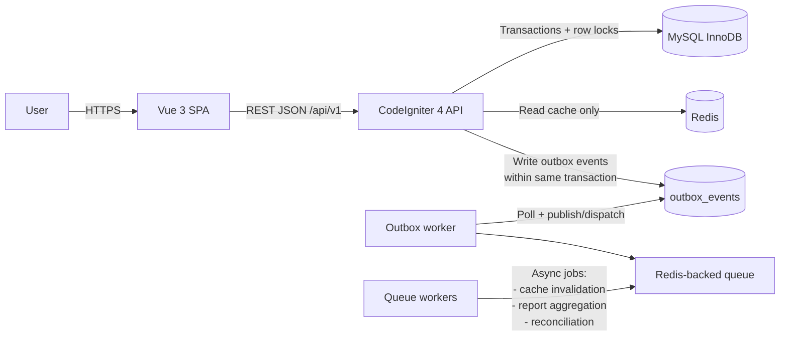
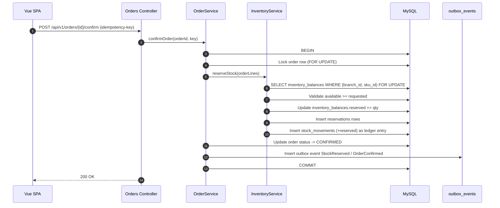
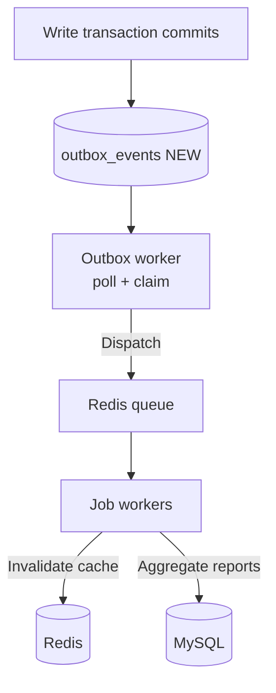
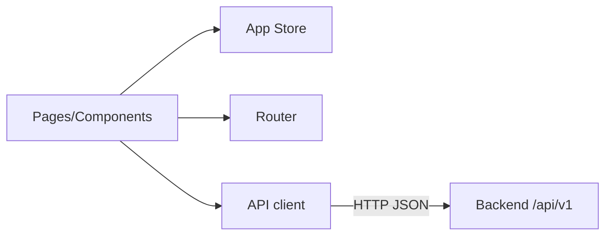

# System Architecture & Design Patterns (`rules/system.md`)

**This document is the canonical source for the project’s system architecture, design patterns, and technical guidelines. All development work must align with the principles and structures outlined herein. Deviations require explicit approval and documentation.**

## 1. Overall Architecture Philosophy

### 1.1. Architectural Style

- **Modular monolith**: one backend deployable unit (CodeIgniter 4) with strict module boundaries.
- **Separation of concerns by module**: business capabilities are grouped into modules (Auth/RBAC, Branches, Catalog, Inventory, Orders, Reporting).
- **Layered architecture inside each module**:
  - **Controllers** (REST API boundary)
  - **Services** (application/use-case orchestration)
  - **Domain** (entities/value objects/rules)
  - **Repositories** (persistence abstraction; talks to DB/query builder)
- **Event-driven inside the monolith**:
  - Domain events are produced by services.
  - A **transactional outbox** provides reliable asynchronous processing.

### 1.2. High-Level Component Diagram



### 1.3. Non-Negotiable Principles

- **MySQL is the source of truth** for inventory availability decisions.
- **Redis is never authoritative** for stock deduction/reservation; it only caches derived read models.
- **Correctness > convenience** for inventory flows: reservation/deduction must be strongly consistent using transactions and row-level locks.
- **Auditability**: stock changes are recorded in an append-only ledger; sensitive actions are audit logged.

## 2. Backend System Patterns

### 2.1. Core Backend Architecture

- **Framework**: CodeIgniter 4.
- **Modules as bounded contexts**: modules are the primary boundary for code organization and ownership.
- **Dependency direction**:
  - Controllers depend on Services.
  - Services depend on Domain and repository interfaces.
  - Repositories depend on infrastructure/DB/query builder.
  - Modules should not depend on each other’s persistence internals.

```mermaid
flowchart TB
    C[Controllers
(REST API)] --> S[Services
(Application logic)]
    S --> D[Domain
(Entities/Rules)]
    S --> R[Repositories
(Persistence)]
    R --> DB[(MySQL)]

    S -->|Append event| O[(outbox_events)]
    S -->|Emit domain event| E[Domain Events]
```

### 2.2. Key Backend Design Patterns

1. **Repository Pattern**
   - **Purpose**: isolate domain/services from query builder / schema details.
   - **Application**: each module exposes repositories (e.g., `InventoryBalanceRepository`, `OrderRepository`).
   - **Rule**: services must not embed complex SQL beyond trivial lookups; complex persistence belongs in repositories.

2. **Facade Pattern (Module service facade)**
   - **Purpose**: expose a clear module-level API and hide multi-table workflows.
   - **Application**: module “public surface area” is the Services layer (e.g., `InventoryService`, `OrderService`).
   - **Rule**: controllers should call services; controllers should not coordinate multi-repository operations.

3. **Observer / Publish-Subscribe via Domain Events**
   - **Purpose**: decouple core write workflows from side effects.
   - **Application**: services emit events such as `StockReserved`, `StockDeducted`, `ProductUpdated`.
   - **Rule**: side effects (cache invalidation, reporting updates, reconciliation) run asynchronously via outbox + workers.

4. **Transactional Outbox**
   - **Purpose**: guarantee events are not lost and allow safe retries.
   - **Application**: write transactions persist outbox records (`event_type`, `payload_json`, status, attempts).
   - **Rule**: any side effect that must occur “after commit” must be triggered from the outbox, not inline.

### 2.3. Backend Component Relationships & Flows

#### 2.3.1. Inventory Correctness (Reservation/Deduction)

- Reservations and deductions **must be executed inside a single DB transaction**.
- Inventory balance rows are locked using **row-level locking** on `(branch_id, sku_id)` during reservation/deduction.
- **Idempotency** is required for retryable write endpoints (e.g., confirm order, deduct stock) to avoid double reservation/deduction.



#### 2.3.2. Outbox -> Workers Flow

- Outbox worker polls `outbox_events` and processes records in a retryable way.
- Workers handle:
  - cache invalidation/update
  - reporting aggregation
  - reconciliation checks



### 2.4. Backend Module/Directory Structure

Backend code is organized as follows (authoritative target structure):

```text
backend/
  app/
    Config/
    Database/
      Migrations/
      Seeds/
    Filters/
    Libraries/
      Cache/
      Events/
      Queue/
    Modules/
      Auth/
        Controllers/
        Domain/
        Services/
        Routes.php
      Rbac/
        Controllers/
        Domain/
        Policies/
        Routes.php
      Branches/
        Controllers/
        Domain/
        Services/
        Routes.php
      Catalog/
        Controllers/
        Domain/
        Services/
        Routes.php
      Inventory/
        Controllers/
        Domain/
        Services/
        Jobs/
        Routes.php
      Orders/
        Controllers/
        Domain/
        Services/
        Jobs/
        Routes.php
      Reporting/
        Controllers/
        ReadModel/
        Jobs/
        Routes.php
      Shared/
        Domain/
        Dto/
        Utils/
    Views/
  public/
  tests/
    Feature/
    Unit/
    Support/
  writable/
  composer.json
  phpunit.xml
```

Directory intent (minimum rules):

- Modules/<ModuleName>/Controllers/: HTTP boundary; request parsing, auth checks, response shaping.
- Modules/<ModuleName>/Services/: use-case orchestration; transactions; emits domain events; writes outbox.
- Modules/<ModuleName>/Domain/: domain entities/value objects; pure rules; no framework dependencies.
- Modules/<ModuleName>/Jobs/: async job handlers invoked by workers.
- Modules/Reporting/ReadModel/: read-optimized models/queries used for reporting endpoints.
- Modules/Shared/*: shared primitives (DTOs, small utilities) used across modules.

### 2.5. Data Model & Storage Patterns (MySQL)

MySQL (InnoDB) is the system of record for all write models: orders, inventory balances, reservations, and the append-only stock movement ledger.

Schema organization rule: separate fast “current state” tables from append-only “history/audit” tables.

- Current state tables (write-optimized, authoritative state)
  - branches
  - products, skus (unique constraints on sku_code and barcode)
  - inventory_balances (unique (branch_id, sku_id); numeric columns for on_hand and reserved; available is derived)
  - reservations (per order_line, includes status and expiry)
  - orders, order_lines
  - users, roles, permissions, user_roles, role_permissions, user_branches
- History/audit tables (append-only, traceability)
  - stock_movements (append-only ledger: branch_id, sku_id, qty_delta, movement_type, reference_type/id, actor_id, created_at, reason)
  - audit_logs (security and sensitive actions)
  - outbox_events (event_type, payload_json, status, available_at, attempts, created_at)

Minimum pragmatic indexing rules:

- inventory_balances: unique(branch_id, sku_id)
- stock_movements: (branch_id, sku_id, created_at) and (reference_type, reference_id)
- orders: (branch_id, status, created_at)
- reservations: (branch_id, status, expires_at)
- skus: unique(sku_code), unique(barcode); add compound/fulltext indexes only when a concrete query requires it

## 3. Frontend System Patterns

### 3.1. Core Frontend Architecture

- **SPA**: Vue 3 single-page application.
- **Thin client**: the frontend orchestrates workflows and renders UI; **business rules live on the backend**.
- **Backend contract**: RESTful JSON API, versioned under /api/v1.



### 3.2. Key Frontend Technical Decisions & Patterns

- **API layer**: centralized API client in src/api/ (auth token handling, request IDs, consistent error mapping).
- **Routing**: centralized router setup under src/app/router/.
- **State management**: centralized store under src/app/store/.
- **Module slices**: feature modules in src/modules/ should own their components/pages/state where appropriate.

### 3.3. Frontend Structure

```text
frontend/
  src/
    api/
    app/
      router/
      store/
    modules/
      auth/
      branches/
      catalog/
      inventory/
      orders/
      reporting/
    components/
    pages/
    styles/
    main.ts
  index.html
  package.json
  vite.config.ts
```

### 3.4. Critical Frontend Implementation Paths/Flows

- Authenticated access and role/branch-scoped authorization-driven UI.
- Product search (read-heavy; backend may cache results in Redis).
- Order creation + confirm/fulfill/cancel flows (backend is authoritative; frontend handles retries with idempotency keys).
- Reporting dashboards (read-heavy; backend caches derived KPI views with TTL and event-driven invalidation).

## 4. Cross-Cutting Concerns & Platform-Wide Patterns

### 4.1. Error Handling

- Return a consistent JSON error shape across modules (fields: code, message, details, request_id).
- Use correct HTTP status codes and avoid leaking internal stack traces in responses.
- Validation failures must be deterministic and explicit (field-level errors in details).
- Backend should centralize exception-to-response mapping (e.g., via a filter/middleware pattern) so modules behave consistently.
- Frontend should treat network/5xx errors as retryable where safe, and must rely on idempotency keys for retryable writes.

### 4.2. API Design Principles

- **Versioned API**: all endpoints under /api/v1.
- **RESTful JSON**: consistent resource naming, HTTP verbs, and status codes.
- **Idempotent writes where required**: endpoints that can be retried must accept and enforce an **idempotency key**.
- **Error contract**: return a consistent JSON error shape across modules (fields: code, message, details, request_id).

### 4.2. Data Consistency & Concurrency

- **Transactions**: any workflow touching orders + inventory must execute in a transaction.
- **Row-level locks**: lock the `inventory_balances` row for `(branch_id, sku_id)` during reserve/deduct/release.
- **Derived availability**: treat `available = on_hand - reserved` as derived; do not store “available” as a persisted column unless explicitly justified.

### 4.3. Caching (Redis)

- **Allowed**: derived, read-only views (dashboard KPIs, product search results, branch inventory snapshots).
- **Disallowed**: using Redis as the source of truth for availability or as the only store for reservations/deductions.
- **Invalidation**: cache keys must be invalidated/updated via outbox-driven events.

### 4.4. Security

- **Authentication**: implemented first; protects all non-public API routes.
- **Authorization**: RBAC is enforced server-side for every sensitive operation (inventory adjustments, receiving, deductions, user/role changes).
- **Audit logging**: write audit records for sensitive actions (security and high-impact inventory operations).
- **Branch scoping**: users can be scoped to permitted branches; server-side checks are mandatory.

### 4.5. Validation

- Validate incoming API payloads at the boundary (controller/request layer).
- Validate domain invariants in the domain/services layer (never rely solely on frontend validation).

### 4.6. Logging & Observability

- **Request correlation ID**: generate/propagate a request ID for every API request; include it in logs and error responses.
- **Structured logging**: logs should be queryable (JSON where practical); include actor/user id, branch id, order id, and request id where relevant.
- **Outbox backlog monitoring**: operational dashboards/alerts should track outbox queue depth and worker retries.

### 4.7. Configuration Management

- Use environment-based configuration.
- Maintain `.env.example` as the canonical template.
- Secrets are never committed; they are provided via environment variables / secret manager.

### 4.8. Testing Strategy

- **Backend**: PHPUnit
  - **Unit** tests for domain rules (availability calculations, reservation rules, state transitions).
  - **Feature** tests for API authorization and critical inventory/order flows (reservation/deduction/release).
- **Performance**: JMeter
  - Read-heavy dashboard scenarios
  - Concurrent order confirmations with conflict cases
  - Mixed workloads

## 5. Key Technology Stack Summary

- **Backend**: PHP, CodeIgniter 4
- **Database**: MySQL (InnoDB)
- **Cache**: Redis (derived read views only)
- **Queue**: Redis-backed queue with dedicated worker containers
- **Event reliability**: transactional outbox (`outbox_events` table)
- **Frontend**: Vue 3 SPA, Vite
- **Infrastructure**: Docker, Docker Compose (local dev + early production)
- **Testing**: PHPUnit (unit + feature), JMeter (load testing)

***

_This document should be reviewed and updated as the system evolves._
